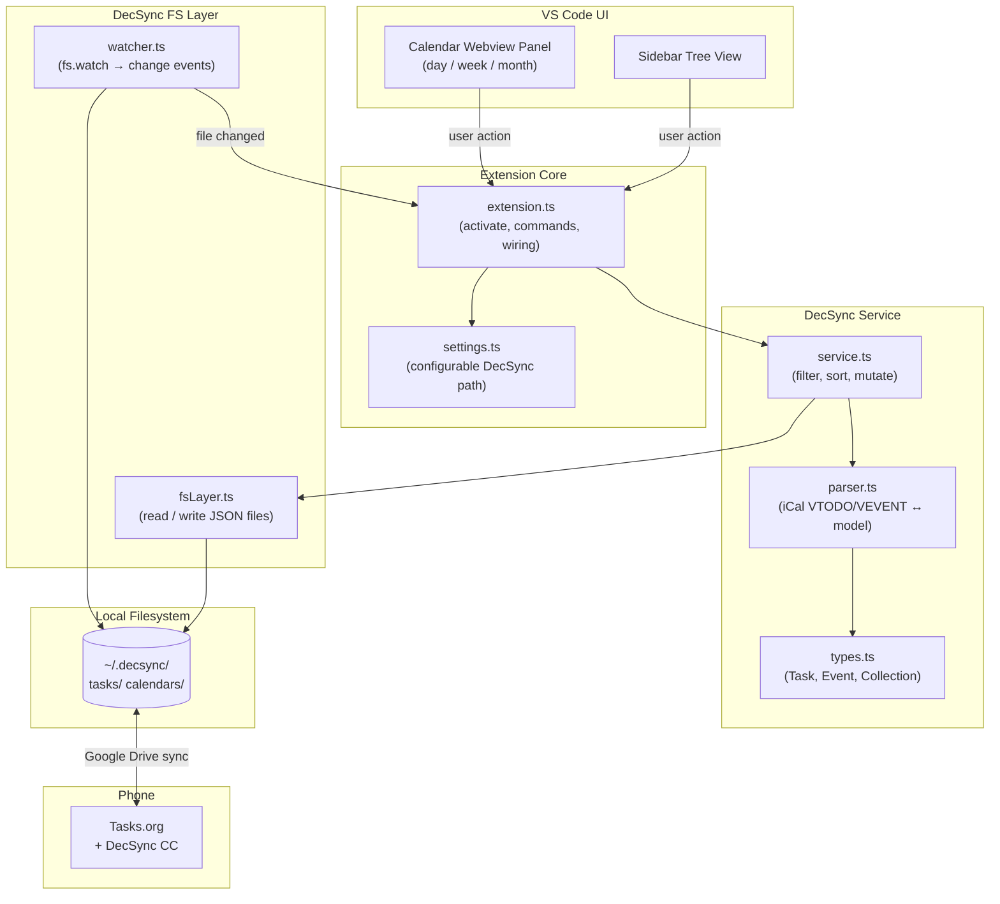
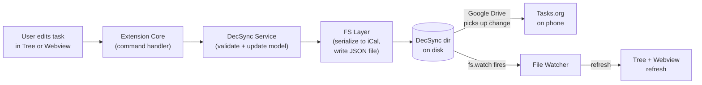

# Architecture

## System Layers



## Edit Task Data Flow



## Source File Structure

```
src/
  extension.ts
  config/
    settings.ts
  decsync/
    types.ts
    parser.ts
    service.ts
    fsLayer.ts
    watcher.ts
  views/
    taskTreeProvider.ts
    calendarPanel.ts
    webview/
      calendar.html
```

## Key Design Decisions

| Decision | Choice | Reason |
|----------|--------|--------|
| iCal parsing | `ical.js` npm package | Handles VTODO + VEVENT + recurrence rules |
| Calendar UI | Custom webview | No native VS Code calendar widget |
| File watching | `workspace.createFileSystemWatcher` | Integrates with extension lifecycle |
| Sync abstraction | FS layer is sync-tool-agnostic | Google Drive (v1) / Syncthing / Proton Drive are interchangeable |
| State | In-memory cache in `service.ts`, invalidated on file change | Avoids re-parsing on every UI interaction |
